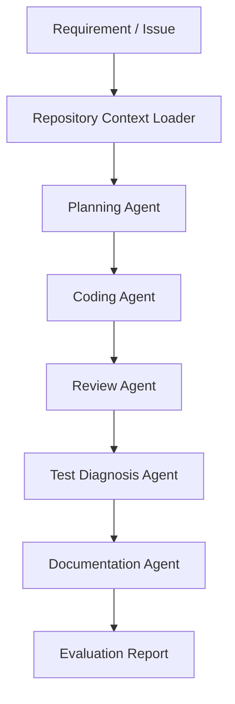

# MiMo Coding Agent Workflow Kit

This repository is a lightweight application and evaluation kit for testing MiMo-V2.5-Pro in AI coding, long-context repository understanding, and agentic development workflows.

The project is designed for the MiMo Orbit program application. It provides a clear use case, workflow design, prompt templates, and a small local demo that can be expanded into a real coding agent benchmark.

## Project Goal

The goal is to evaluate MiMo-V2.5-Pro as a practical coding and agent model for personal developers and small engineering teams.

The workflow focuses on:

- Long-context codebase understanding
- Multi-file code modification planning
- Pull request review
- Test failure diagnosis
- Documentation generation
- Agent workflow orchestration

MiMo-V2.5-Pro is a strong fit because coding agents often need to read source code, issue history, architecture notes, test logs, and previous conversation context in one task. A 1M-token context window can reduce context fragmentation and make agent workflows more reliable.

## Workflow

## Planned Evaluation

The evaluation will compare MiMo with other coding models across repeated real-world tasks.

Metrics:

- Task completion rate
- Quality of implementation plan
- Correctness of code changes
- Test repair success rate
- Review usefulness
- Documentation quality
- Token consumption per completed task
- End-to-end development time

## Expected Token Usage

This project needs a high token quota because each agent task may include:

- Full repository summaries
- Source files
- Test logs
- Design notes
- Multi-turn debugging history
- Model comparison prompts and outputs

Estimated usage:

- Single coding task: 100K to 1M tokens
- Daily evaluation: 3M to 8M tokens
- Four-week evaluation: 100M+ tokens

If granted a Max token plan, the project will run a broader benchmark covering at least 20 coding-agent tasks and publish the results as a public practice note or open-source template.

## Repository Contents

- `application/max-plan-application-zh.md`: Chinese application text for the MiMo Orbit form
- `docs/workflow-zh.md`: Chinese workflow explanation
- `prompts/`: Prompt templates for agent roles
- `examples/sample-task.md`: A sample benchmark task
- `scripts/evaluate_task.js`: A tiny local evaluation report generator

## Status

This is an early-stage builder project. The current repository provides the workflow design and application materials. The next stage is to connect MiMo-V2.5-Pro API access and run repeated coding-agent evaluations.
