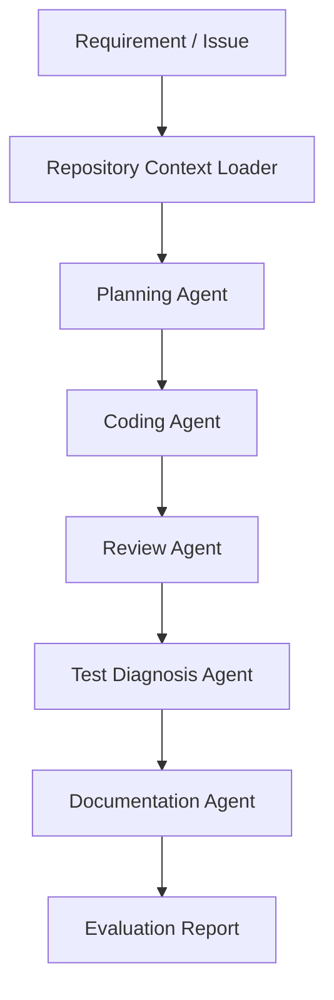

# Task: Stress test long-context repository reading

Type: long-context-stress
Objective: Bundle docs, prompts, examples, and reports into a large context prompt to test consistency.

## Agents
- repository-context-loader
- planning-agent
- review-agent
- documentation-agent

## Expected Outputs
- context summary
- contradiction report
- next-run plan

## Success Criteria
- preserves project intent
- finds inconsistencies
- proposes concrete next tasks

## Repository Context
## README.md
# MiMo Coding Agent Workflow Kit

This repository is a runnable benchmark harness for testing MiMo-V2.5-Pro in AI coding, long-context repository understanding, and agentic development workflows.

The project is designed for the MiMo Orbit program application. It provides a task catalog, prompt builder, token estimator, report generator, and local dashboard that can be expanded into a real MiMo coding-agent benchmark.

## Project Goal

The goal is to evaluate MiMo-V2.5-Pro as a practical coding and agent model for personal developers and small engineering teams.

The workflow focuses on:

- Long-context codebase understanding
- Multi-file code modification planning
- Pull request review
- Test failure diagnosis
- Documentation generation
- Agent workflow orchestration

MiMo-V2.5-Pro is a strong fit because coding agents often need to read source code, issue history, architecture notes, test logs, and previous conversation context in one task. A 1M-token context window can reduce context fragmentation and make agent workflows more reliable.

## Workflow



## Planned Evaluation

The evaluation will compare MiMo with other coding models across repeated real-world tasks.

Metrics:

- Task completion rate
- Quality of implementation plan
- Correctness of code changes
- Test repair success rate
- Review usefulness
- Documentation quality
- Token consumption per completed task
- End-to-end development time

## Expected Token Usage

This project needs a high token quota because each agent task may include:

- Full repository summaries
- Source files
- Test logs
- Design notes
- Multi-turn debugging history
- Model comparison prompts and outputs

Estimated usage:

- Single production coding task: 350K to 1.8M tokens across multi-agent calls
- Weekly evaluation cadence: 80+ task runs across planning, coding, review, diagnosis, docs, and comparison
- Four-week projected usage: 229.6M tokens based on the current benchmark profile

If granted a Max token plan, the project will run a broader benchmark covering at least 20 coding-agent tasks and publish the results as a public practice note or open-source template.

## Runnable Artifacts

This repository includes a real evaluation surface:

- `scripts/run_benchmark.js`
- `src/benchmark-runner.js`
- `src/prompt-builder.js`
- `src/token-estimator.js`
- `dashboard/index.html`
- `data/tasks.json`
- `data/model-comparison-template.md`
- `reports/benchmark-report.json` after running `npm run benchmark`

Run:

```bash
npm run benchmark
npm run evaluate
npm run report
npm run dashboard
```

Dashboard:

```text
http://localhost:4173
```

## Why This Looks Like a Max-Plan Project

The repository is built around repeated long-context work rather than a one-off prompt:

- full-repo reading
- multi-file implementation planning
- test diagnosis
- review workflows
- documentation updates
- model comparison records

That shape is intentional because the actual workload needs many large-context calls over multiple tasks.

The current generated benchmark report projects `229,600,000` tokens across a four-week evaluation cycle. The seed repository is intentionally small, while the production profile models the real workload: larger repos, repeated runs, multiple agent stages, and model comparison passes.

## Repository Contents

- `application/max-plan-application-zh.md`: Chinese application text for the MiMo Orbit form
- `docs/workflow-zh.md`: Chinese workflow explanation
- `prompts/`: Prompt templates for agent roles
- `examples/sample-task.md`: A sample benchmark task
- `scripts/evaluate_task.js`: A tiny local evaluation report generator
- `scripts/build_report.js`: A report builder that summarizes the repo artifacts
- `scripts/run_benchmark.js`: Generates prompt bundles, benchmark reports, and dashboard data
- `data/tasks.json`: A small benchmark task catalog
- `data/model-comparison-template.md`: A template for multi-model comparisons
- `dashboard/`: Local visual console for benchmark runs
- `src/`: Benchmark runner implementation
- `fixtures/`: Simulated logs and diffs for review and diagnosis tasks
- `docs/architecture.md`: System architecture
- `docs/max-plan-evidence.md`: Max-plan evidence summary
- `docs/runbook.md`: Local runbook

## Status

This is an early-stage builder project with a runnable offline benchmark mode. The next stage is to connect MiMo-V2.5-Pro API access and attach real model outputs to each task run.


## docs/workflow-zh.md
# MiMo Coding Agent 工作流说明

## 背景

传统 AI 编程助手通常只处理单个文件或短上下文问题，但真实研发任务往往需要模型理解完整项目。尤其是 Agent 工作流，会反复读取需求、代码、测试、日志和历史修改记录。

MiMo-V2.5-Pro 的长上下文能力适合这类场景，因为它可以减少上下文切片带来的信息丢失，让模型更稳定地理解工程全貌。

## 工作流设计

### 1. Repository Context Loader

收集项目上下文：

- 目录结构
- README
- package 配置
- 关键源码
- 测试文件
- 最近变更
- 错误日志

### 2. Planning Agent

输出：

- 任务拆解
- 影响范围
- 修改计划
- 风险点
- 测试计划

### 3. Coding Agent

输出：

- 代码修改方案
- 多文件改动
- 测试补充
- 类型错误修复

### 4. Review Agent

检查：

- 是否遗漏边界条件
- 是否引入兼容性问题
- 是否缺少测试
- 是否存在安全或性能风险
- 是否符合项目现有风格

### 5. Test Diagnosis Agent

处理：

- 单元测试失败
- 构建失败
- 类型检查失败
- 运行时错误
- 回归问题

### 6. Documentation Agent

生成：

- README 更新
- API 文档
- 迁移说明
- 发布说明
- 示例用法

## 评估指标

- 任务完成率
- 代码正确性
- Review 有效性
- 测试修复成功率
- 文档可读性
- Token 消耗
- 平均完成时间


## application/max-plan-application-v2-zh.md
# MiMo Orbit Max Plan 申请文案 V2

我正在构建一个面向个人开发者和小团队的 AI Coding Agent 工作流，核心目标不是单次问答，而是持续跑真实工程任务：需求分析、仓库理解、任务拆解、代码修改、Review、测试修复和文档生成。这个工作流会反复读取完整仓库、接口文档、Issue、测试日志和多轮修改历史，因此非常依赖长上下文和稳定的 Agent 编排能力。

目前我已经完成了项目骨架、工作流设计、Prompt 模板、示例任务和本地评估脚本，并将这些材料整理成一个可公开的 GitHub 项目。为了尽量真实地评估模型能力，我把任务设计成多轮、多文件、长上下文、带失败回收的 coding-agent 场景，而不是简单的单轮文本生成。

我申请 Max Plan 的原因是：这类任务的 Token 消耗不是一次性的，而是持续性的。单个真实任务会同时包含项目目录、源代码、需求说明、测试输出、错误栈、修复过程和最终总结，通常需要十万到百万级 Token。若要完成连续评估、多模型对比和稳定性验证，需要更高额度才能跑足够多的任务样本，得出可信结论。

如果获得 Max Plan，我会把 MiMo 主要用于以下场景：

1. 读取完整代码仓库并生成实施计划。
2. 对多文件改动进行一次性理解和修正。
3. 针对测试失败和构建错误做连续诊断与修复。
4. 对 Pull Request 做自动 Review，并补测试与文档。
5. 产出可公开复用的 Agent 工作流、Prompt 模板和评估记录。

我希望用这笔额度完成至少 20 个真实 coding-agent 任务，覆盖不同技术栈和失败模式，并整理出公开的实践文档或示例仓库。如果效果稳定，我会继续把这套工作流扩展成面向开发者的长期评估模板，为 MiMo 生态提供真实使用反馈，而不是停留在一次性试用。


## reports/task-matrix.md
# Coding Agent Task Matrix

This matrix describes the type of tasks this project is designed to evaluate.

| Task Type | Inputs | Output | Why Long Context Matters |
| --- | --- | --- | --- |
| Repo understanding | Full tree, README, configs, key source files | Architecture summary, dependency map | The model must read many files together |
| Feature planning | Issue, product notes, codebase state | Implementation plan, risk list | Planning depends on complete project context |
| Multi-file coding | Several source files and tests | Patch across modules | Changes must stay consistent across files |
| Test diagnosis | Failing logs, test files, recent diff | Root cause, minimal fix | Error text and code must be compared together |
| PR review | Diff, tests, project conventions | Findings and missing tests | Review quality depends on repo-wide style |
| Docs update | Code changes, release notes, README | Documentation patch | Docs must reflect implementation accurately |

## Evaluation cadence

- Baseline run: 1 to 3 tasks
- Weekly run: 5 to 10 tasks
- Full benchmark: 20+ tasks

## Token profile

- Small task: 10K to 50K tokens
- Typical task: 100K to 300K tokens
- Heavy task: 300K to 1M tokens

The project is intentionally structured around repeated long-context tasks so that the model is evaluated in the same way it will be used in practice.


## reports/evaluation-journal-template.md
# Evaluation Journal Template

Use this template to record real usage evidence after each run.

## Run Metadata

- Date:
- Repo:
- Task type:
- Model:
- Token estimate:
- Duration:

## Inputs

- Requirement:
- Files read:
- Logs read:
- Tests run:

## Output

- Plan quality:
- Code quality:
- Review quality:
- Test repair result:
- Documentation result:

## Notes

- What worked:
- What failed:
- What to improve next:

Keeping this journal turns the project from a one-off demo into a repeatable evaluation workflow.


## prompts/planning-agent.md
# Planning Agent Prompt

You are a senior software engineer acting as a planning agent.

Read the requirement, repository context, source files, and logs. Produce a concise implementation plan.

Return:

1. Goal summary
2. Relevant files
3. Proposed changes
4. Risks and edge cases
5. Test plan
6. Questions only if blocked

Avoid vague advice. Prefer concrete file-level actions.


## prompts/review-agent.md
# Review Agent Prompt

You are a code review agent.

Review the proposed diff as if it were a production pull request.

Focus on:

- Correctness
- Edge cases
- Security
- Performance
- Backward compatibility
- Missing tests
- Maintainability

Return findings ordered by severity. Include file and line references when available. If no issues are found, say so and list residual risks.


## prompts/test-diagnosis-agent.md
# Test Diagnosis Agent Prompt

You are a test diagnosis agent.

Read the failing test output, source files, recent changes, and expected behavior. Identify the most likely root cause and propose the smallest safe fix.

Return:

1. Failure summary
2. Most likely root cause
3. Evidence
4. Minimal fix
5. Regression tests to add

