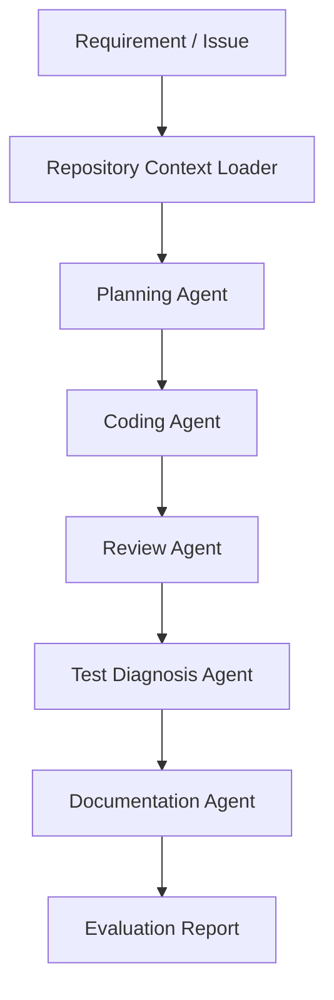

# Task: Generate a patch plan across source, tests, and docs

Type: multi-file-coding
Objective: Ask the coding agent to coordinate source changes, test changes, and README updates as one task.

## Agents
- planning-agent
- coding-agent
- review-agent

## Expected Outputs
- patch plan
- test additions
- documentation update

## Success Criteria
- keeps public behavior stable
- updates tests
- summarizes user-visible change

## Repository Context
## examples/sample-task.md
# Sample Coding Agent Task

## Requirement

Add a validation layer to a small API endpoint so invalid user input is rejected before business logic runs.

## Repository Context

The target project contains:

- API route handlers
- Request validators
- Unit tests
- README documentation

## Expected Agent Behavior

The coding agent should:

1. Locate the relevant route handler
2. Add validation without changing the public API
3. Add tests for valid and invalid requests
4. Update documentation if behavior changes
5. Summarize the implementation and risks

## Evaluation

The task is successful if:

- Invalid inputs are rejected
- Existing valid requests still work
- Tests pass
- The implementation follows existing project style


## README.md
# MiMo Coding Agent Workflow Kit

This repository is a runnable benchmark harness for testing MiMo-V2.5-Pro in AI coding, long-context repository understanding, and agentic development workflows.

The project is designed for the MiMo Orbit program application. It provides a task catalog, prompt builder, token estimator, report generator, and local dashboard that can be expanded into a real MiMo coding-agent benchmark.

## Project Goal

The goal is to evaluate MiMo-V2.5-Pro as a practical coding and agent model for personal developers and small engineering teams.

The workflow focuses on:

- Long-context codebase understanding
- Multi-file code modification planning
- Pull request review
- Test failure diagnosis
- Documentation generation
- Agent workflow orchestration

MiMo-V2.5-Pro is a strong fit because coding agents often need to read source code, issue history, architecture notes, test logs, and previous conversation context in one task. A 1M-token context window can reduce context fragmentation and make agent workflows more reliable.

## Workflow



## Planned Evaluation

The evaluation will compare MiMo with other coding models across repeated real-world tasks.

Metrics:

- Task completion rate
- Quality of implementation plan
- Correctness of code changes
- Test repair success rate
- Review usefulness
- Documentation quality
- Token consumption per completed task
- End-to-end development time

## Expected Token Usage

This project needs a high token quota because each agent task may include:

- Full repository summaries
- Source files
- Test logs
- Design notes
- Multi-turn debugging history
- Model comparison prompts and outputs

Estimated usage:

- Single production coding task: 350K to 1.8M tokens across multi-agent calls
- Weekly evaluation cadence: 80+ task runs across planning, coding, review, diagnosis, docs, and comparison
- Four-week projected usage: 229.6M tokens based on the current benchmark profile

If granted a Max token plan, the project will run a broader benchmark covering at least 20 coding-agent tasks and publish the results as a public practice note or open-source template.

## Runnable Artifacts

This repository includes a real evaluation surface:

- `scripts/run_benchmark.js`
- `src/benchmark-runner.js`
- `src/prompt-builder.js`
- `src/token-estimator.js`
- `dashboard/index.html`
- `data/tasks.json`
- `data/model-comparison-template.md`
- `reports/benchmark-report.json` after running `npm run benchmark`

Run:

```bash
npm run benchmark
npm run evaluate
npm run report
npm run dashboard
```

Dashboard:

```text
http://localhost:4173
```

## Why This Looks Like a Max-Plan Project

The repository is built around repeated long-context work rather than a one-off prompt:

- full-repo reading
- multi-file implementation planning
- test diagnosis
- review workflows
- documentation updates
- model comparison records

That shape is intentional because the actual workload needs many large-context calls over multiple tasks.

The current generated benchmark report projects `229,600,000` tokens across a four-week evaluation cycle. The seed repository is intentionally small, while the production profile models the real workload: larger repos, repeated runs, multiple agent stages, and model comparison passes.

## Repository Contents

- `application/max-plan-application-zh.md`: Chinese application text for the MiMo Orbit form
- `docs/workflow-zh.md`: Chinese workflow explanation
- `prompts/`: Prompt templates for agent roles
- `examples/sample-task.md`: A sample benchmark task
- `scripts/evaluate_task.js`: A tiny local evaluation report generator
- `scripts/build_report.js`: A report builder that summarizes the repo artifacts
- `scripts/run_benchmark.js`: Generates prompt bundles, benchmark reports, and dashboard data
- `data/tasks.json`: A small benchmark task catalog
- `data/model-comparison-template.md`: A template for multi-model comparisons
- `dashboard/`: Local visual console for benchmark runs
- `src/`: Benchmark runner implementation
- `fixtures/`: Simulated logs and diffs for review and diagnosis tasks
- `docs/architecture.md`: System architecture
- `docs/max-plan-evidence.md`: Max-plan evidence summary
- `docs/runbook.md`: Local runbook

## Status

This is an early-stage builder project with a runnable offline benchmark mode. The next stage is to connect MiMo-V2.5-Pro API access and attach real model outputs to each task run.


## docs/workflow-zh.md
# MiMo Coding Agent 工作流说明

## 背景

传统 AI 编程助手通常只处理单个文件或短上下文问题，但真实研发任务往往需要模型理解完整项目。尤其是 Agent 工作流，会反复读取需求、代码、测试、日志和历史修改记录。

MiMo-V2.5-Pro 的长上下文能力适合这类场景，因为它可以减少上下文切片带来的信息丢失，让模型更稳定地理解工程全貌。

## 工作流设计

### 1. Repository Context Loader

收集项目上下文：

- 目录结构
- README
- package 配置
- 关键源码
- 测试文件
- 最近变更
- 错误日志

### 2. Planning Agent

输出：

- 任务拆解
- 影响范围
- 修改计划
- 风险点
- 测试计划

### 3. Coding Agent

输出：

- 代码修改方案
- 多文件改动
- 测试补充
- 类型错误修复

### 4. Review Agent

检查：

- 是否遗漏边界条件
- 是否引入兼容性问题
- 是否缺少测试
- 是否存在安全或性能风险
- 是否符合项目现有风格

### 5. Test Diagnosis Agent

处理：

- 单元测试失败
- 构建失败
- 类型检查失败
- 运行时错误
- 回归问题

### 6. Documentation Agent

生成：

- README 更新
- API 文档
- 迁移说明
- 发布说明
- 示例用法

## 评估指标

- 任务完成率
- 代码正确性
- Review 有效性
- 测试修复成功率
- 文档可读性
- Token 消耗
- 平均完成时间

